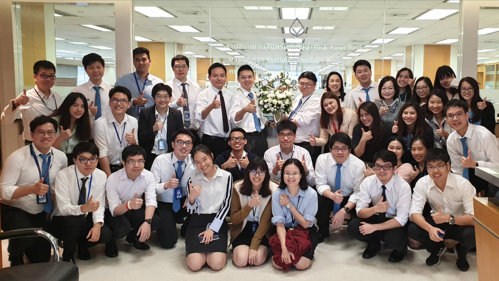
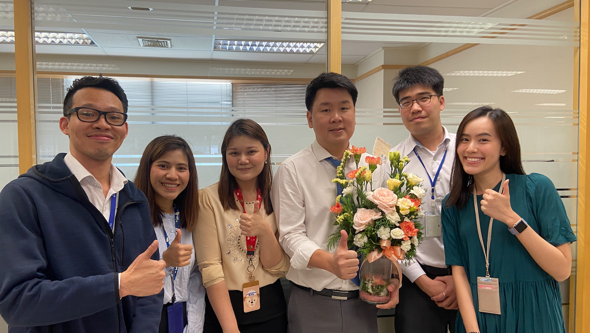
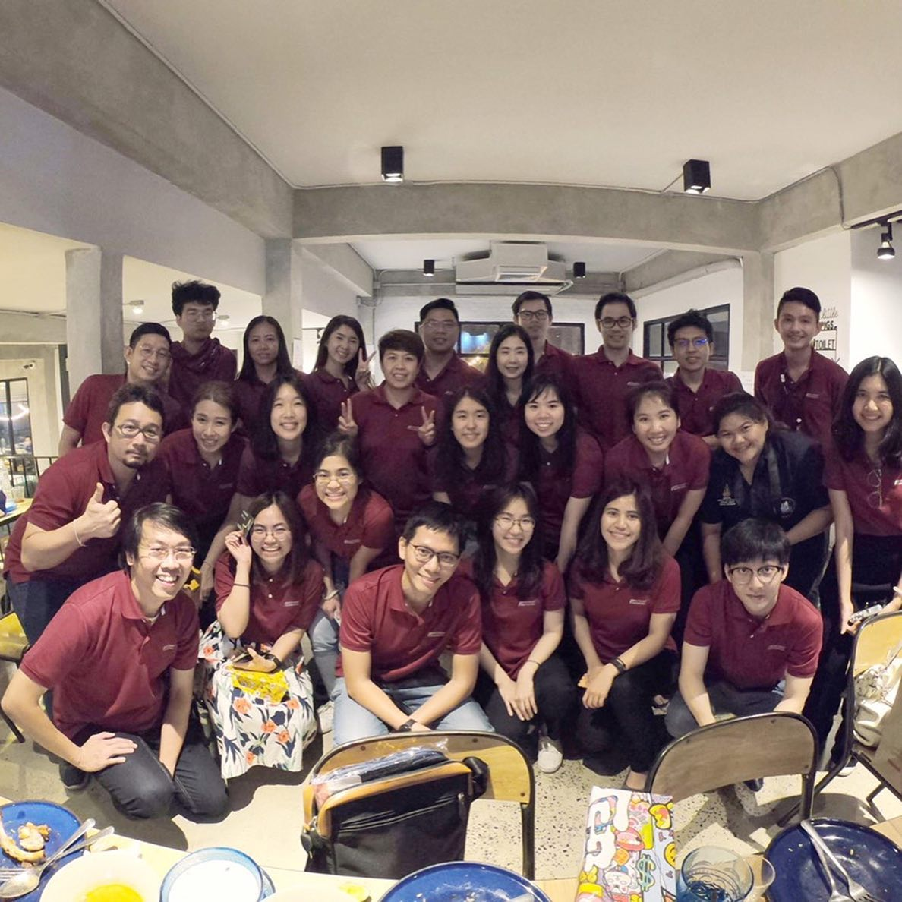
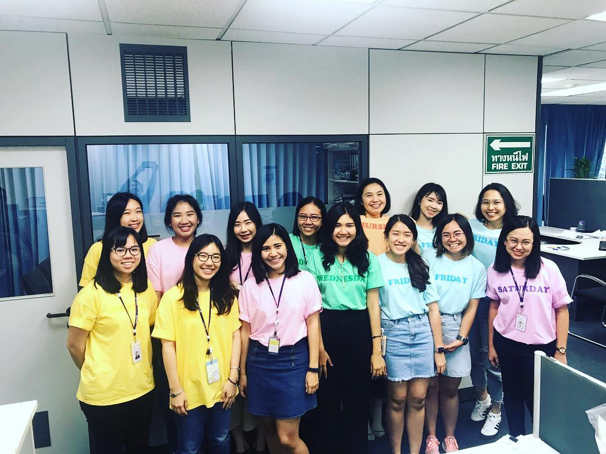

## My Work Experience

- **Research Analyst Intern** at YMY Solutions 
  Chicago IL, USA (June 2021 - Current)

"Working in business consulting firm is totally a game changer of my life. Every project is unique. It's required expertise to innovate and flexibility to develop the strategy and process of improvement. I did not only developed my competencies, but also creativity and ideation while I was working with YMY Solutions."

- **Portfolio Management Analyst** at Bangkok Bank
  Bangkok, Thailand (August 2019 - August 2020)  
  
Portfolio Management Unit (PMU) 
  

Portfolio Management Unit, SME Team(PMU)  
  

"The proudest analysis that I had done was initiating portfolio management optimize strategy which can reduce default and increase overall profit 5% per portfolio. I developed Automatic Models, built loss-forecasting models and balanced default risk and interest return from SMEs under TCG program to augment income. Overall, I had a great time being an Portfolio Management Analyst. I love the job, people and company culture."

- **Process Engineering Consultant** at Technip FMC 
  Bangkok, Thailand (September 2017 - May 2019)
  
Process Engineering Consultant Team  
  

Girl Power: Process Engineering Consultant Team  
  

"I developed the thought process and became more detailed oriented at work. Additionally, I learned how to work well under the pressure and became master in prioritizing works and time management while I was working at TechnipFMC "
